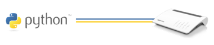

.. fritzconnection documentation master file, created by
   sphinx-quickstart on Tue Mar 19 10:09:48 2019.
   You can adapt this file completely to your liking, but it should at least
   contain the root `toctree` directive.

fritzconnection documentation
=============================

fritzconnection is a `Python <https://www.python.org/>`_ library to communicate with the `AVM Fritz!Box <https://en.avm.de/produkte/fritzbox/>`_ by the TR-064 protocol. This allows to read status-informations from the box and to read and change configuration settings and state.

The available services are depending on the Fritz!Box model and the according system software. fritzconnection can list and access all available services and actions of a given box. Using fritzconnection is as easy as: ::

    from fritzconnection import FritzConnection

    fc = FritzConnection(address='192.168.178.1')
    fc.reconnect()  # get a new external ip from the provider
    print(fc)  # print router model informations

For more informations refer to `Installation <sources/install.html>`_ and `Introduction <sources/introduction.html>`_.

**Note:** fritzconnection is neither related to nor supported by AVM. Also AVM reserves the right to add, modify or remove features of their products at any time without notice.

.. toctree::
   :maxdepth: 2
   :caption: Contents:

   sources/install
   sources/introduction
   sources/library
   sources/api
   sources/further_reading
   sources/changes
   sources/authors
   sources/license

